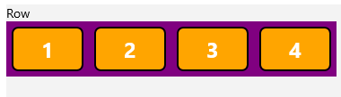
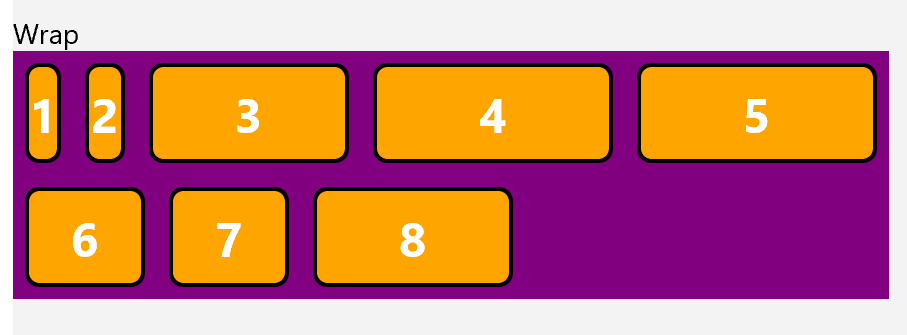
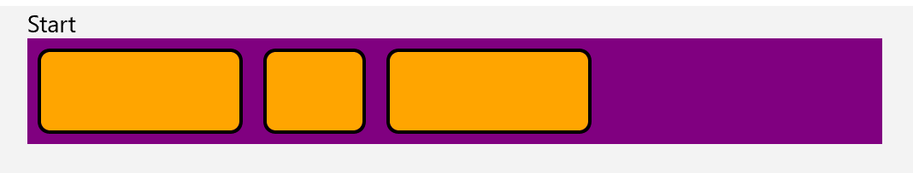
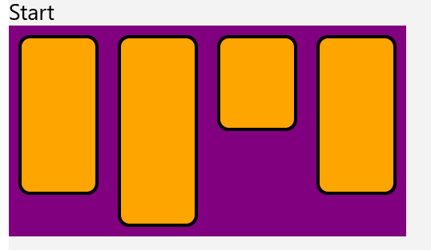
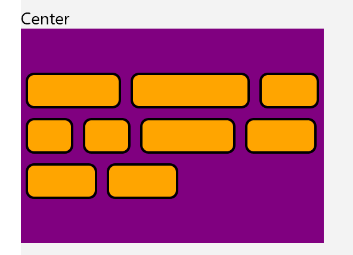
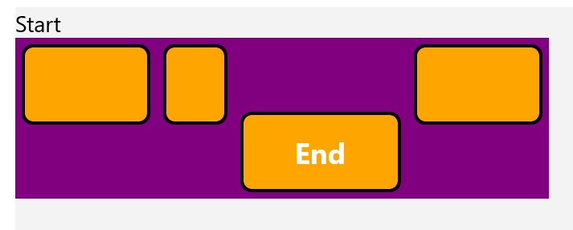

<!--
    Before submitting, delete all "<!-- TEMPLATE marked" comments in this file,
    and the following quote banner:
-->
> See comments in Markdown for how to use this spec template

<!-- TEMPLATE
    The purpose of this spec is to describe new APIs, in a way
    that will transfer to docs.microsoft.com (DMC).

    There are two audiences for the spec. The first are people that want to evaluate and
    give feedback on the API, as part of the submission process.
    When it's complete it will be incorporated into the public documentation at
    http://docs.microsoft.com (DMC).
    Hopefully we'll be able to copy it mostly verbatim. So the second audience is
    everyone that reads there to learn how and why to use this API.
    Some of this text also shows up in Visual Studio Intellisense.

    For example, much of the examples and descriptions in the `RadialGradientBrush` API spec
    (https://github.com/microsoft/microsoft-ui-xaml-specs/blob/master/active/RadialGradientBrush/RadialGradientBrush.md)
    were carried over to the public API page on DMC
    (https://docs.microsoft.com/windows/winui/api/microsoft.ui.xaml.media.radialgradientbrush?view=winui-2.5)

    Once the API is on DMC, that becomes the official copy, and this spec becomes an archive.
    For example if the description is updated, that only needs to happen on DMC and needn't
    be duplicated here.

    Examples:
    * New class (RadialGradientBrush):
      https://github.com/microsoft/microsoft-ui-xaml-specs/blob/master/active/RadialGradientBrush/RadialGradientBrush.md
    * New member on an existing class (UIElement.ProtectedCursor):
      https://github.com/microsoft/microsoft-ui-xaml-specs/blob/master/active/UIElement/ElementCursor.md

    Style guide:
    * Use second person; speak to the developer who will be learning/using this API.
    (For example "you use this to..." rather than "the developer uses this to...")
    * Use hard returns to keep the page width within ~100 columns.
    (Otherwise it's more difficult to leave comments in a GitHub PR.)
    * Talk about an API's behavior, not its implementation.
    (Speak to the developer using this API, not to the team implementing it.)
    * A picture is worth a thousand words.
    * An example is worth a million words.
    * Keep examples realistic but simple; don't add unrelated complications.
    (An example that passes a stream needn't show the process of launching the File-Open dialog.)

-->

Flexbox Layout for WinUI 
===

# Background

<!-- TEMPLATE
    Use this section to provide background context for the new API(s) 
    in this spec. Try to briefly provide enough information to be able to read
    the rest of the document.

    This section and the appendix are the only sections that likely
    do not get copied to DMC; they're just an aid to reading this spec.

    For example this is a place to provide a brief explanation of some dependent
    area, just explanation enough to understand this new API, rather than telling
    the reader "go read 100 pages of background information posted at ...".

    For example this section is a place to explain why you're adding this new API rather than
    using an existing related API.

    For a simple example see the spec for the UIElement.ProtectedCursor property
    (https://github.com/microsoft/microsoft-ui-xaml-specs/blob/master/active/UIElement/ElementCursor.md)
    which has some of the thinking about how this Xaml API relates to existing
    Composition and WPF APIs. This is interesting background both for the current reader
    and the future reader trying to understand why we designed it this way,
    but not the kind of information
    that would land on DMC.
-->


Flexbox Layout is designed to provide an efficient way to layout, align, and distribute space among items within a container, specifically when the size of the device is either unknown or dynamic.

Flexbox is a widely used layout schematic in web development, it allows developers to quickly create complex layouts with a standardized system. By introducing Flexbox to WinUI we can increase the layout choices developers have and cater to those who desire to use this popular layout in their WinUI applications.

More on Flexbox available here: https://css-tricks.com/snippets/css/a-guide-to-flexbox/#aa-flexbox-properties


# Conceptual pages (How To)

_(This is conceptual documentation that will go to docs.microsoft.com "how to" page)_

<!-- TEMPLATE
    (Optional)

    All APIs have a page on DMC, some APIs or groups of APIs have an additional high level,
    conceptual page (called a "how-to" page). This section can be used for that content.

    For example, there are several Xaml controls for different forms of text input,
    each with an API page, and then there's also a conceptual page that
    discusses them collectively
    (https://docs.microsoft.com/windows/uwp/design/controls-and-patterns/text-controls).

    Another way to use this section is as a draft of a blog post that introduces the new feature.

    Sometimes it's difficult to decide if text belongs on a how-to page or an API page.
    It's not important to make a final decision on that in this spec; we can always
    adjust it when copying to DMC.
-->

WinUI Offers several Layout options, such as StackLayout and Flowlayout. Usage of Flexbox Layout will behave similarly and interact by wrapping your desired elements in a Layout Control.


## Remarks

#### Traditional CSS Behavior vs Flexbox in WinUI

Several behaviors may deviate from the exact behavior found in CSS Flexbox, to highlight one in XAML, items do not overflow their containers, rather they simply will be omitted from the layout.


# API Pages

_(Each of the following L2 sections correspond to a page that will be on docs.microsoft.com)_

<!-- TEMPLATE

  Each of the L2 sections in this "API Pages" section corresponds to a page on DMC.

  It's not necessary to have a section for every class member though:
  * If its purpose and usage is obvious from it's name/type, it's not necessary to
    create a section for it.
  * If its purpose and usage is fully explained by brief description, either
      put it in a table in the "Other [class] members" section
      put it with /// comments in the IDL section

  Create an L2 section here for each API that needs more description or examples.
  For a new class with members, the members should go in their own L2 section.

  Example layout
    ## MyClass
    ## MyClass.Member1
    ## MyClass.Member2
    ## Other MyClass members
    ## MyOtherClass
    ## ...

  Notes:
  * The first line of each of these sections should become that first line on the DMC page,
    which then becomes the description you see in Intellisense.
  * Each page can have description, examples, and remarks.
    Remarks are where the documentation calls out special considerations that the developer
    should be aware of.
  * It can be helpful at the top of an API page (or after the Intellisense text) to add the
    API signature in C#
  * Add a "_Spec note: ..._" to add a note that's useful in this spec but shouldn't go to DMC.
  * Show _examples_, not _samples_; an example is a snippet, a sample is a full working app.

-->

## Flex Direction


The flex-direction property specifies the direction of the flexible items.
Note: If the element is not a flexible item, the flex-direction property has no effect.


```xml
<controls:LayoutPanel>
    <controls:LayoutPanel.Layout>
        <controls:FlexboxLayout Direction="Row"/>
    </controls:LayoutPanel.Layout>
            <Grid>
                    <TextBlock>1</TextBlock>
            </Grid>
            <Grid>
                <TextBlock>2</TextBlock>
            </Grid>
            <Grid>
                  <TextBlock>3</TextBlock>
            </Grid>
            <Grid>
                  <TextBlock>4</TextBlock>
            </Grid>
</controls:LayoutPanel>
```


### Output of the above code (styling omitted)



##  Flex Direction Accepted Values

| Value | Description |
|-|-|
| Row (Default) | The flexible items are displayed horizontally, as a row |
| RowReverse | Same behavior as Row, but elemnts are shown in reverse |
| Column | The flexible items are displayed vertically, as a column |
| ColumnReverse | Same behavior as Column, but elemnts are shown in reverse |

# API Details

```c# (but really MIDL3)

runtimeclass FlexboxLayout;

    enum FlexboxDirection
        {
            Row = 0,
            RowReverse = 1,
            Column = 2,
            ColumnReverse = 3
        }
```

## Flex Wrap

The flex-wrap property specifies whether the flexible items should wrap or not.

Note: If the elements are not flexible items, the flex-wrap property has no effect.

```xml

<controls:LayoutPanel MaxWidth="500">
    <controls:LayoutPanel.Layout>
        <controls:FlexboxLayout Direction="Row" Wrap="Wrap"/>
    </controls:LayoutPanel.Layout>
            <Grid MinWidth="10">
                <TextBlock>1</TextBlock>
            </Grid>
            <Grid MinWidth="20">
                <TextBlock>2</TextBlock>
            </Grid>
            <Grid MinWidth="100">
                <TextBlock>3</TextBlock>
            </Grid>
            <Grid MinWidth="120">
                <TextBlock>4</TextBlock>
            </Grid>
            <Grid MinWidth="120">
                <TextBlock>5</TextBlock>
            </Grid>
            <Grid MinWidth="60">
                <TextBlock>6</TextBlock>
            </Grid>
            <Grid MinWidth="60">
                <TextBlock>7</TextBlock>
            </Grid>
            <Grid MinWidth="100">
                <TextBlock>8</TextBlock>
            </Grid>
        </controls:LayoutPanel>
```
### Output of the above code (styling omitted)



##  Flex Wrap Accepted Values

| Value | Description |
|-|-|
| NoWrap (Default) | Default value. Specifies that the flexible items will not wrap |
| Wrap | Specifies that the flexible items will wrap if necessary	|
| WrapReverse | Specifies that the flexible items will wrap, if necessary, in reverse orde |


# API Details

```c# (but really MIDL3)

runtimeclass FlexboxLayout;

    enum FlexboxWrap
        {
            NoWrap = 0,
            Wrap = 1,
            WrapReverse = 2,
        }
```


## Flex JustifyContent

The justify-content property aligns the flexible container's items when the items do not use all available space on the main-axis (horizontally).

```xml

<controls:LayoutPanel>
    <controls:LayoutPanel.Layout>
        <controls:FlexboxLayout JustifyContent="Start"/>
    </controls:LayoutPanel.Layout>
            <Grid MinWidth="120"/>
            <Grid MinWidth="60"/>
            <Grid MinWidth="120"/>
</controls:LayoutPanel>
```

### Output of the above code (styling omitted)


##  Flex JustifyContent Accepted Values

| Value | Description |
|-|-|
| Start (Default) | Items are positioned at the beginning of the container |
| End | Items are positioned at the end of the container|
| Center | Items are positioned in the center of the container |
| SpaceBetween | Items will have space between them |
| SpaceAround | Items are positioned at the end of the container|
| SpaceEvenly | Items will have space before, between, and after them	 |

# API Details


```c# (but really MIDL3)

runtimeclass FlexboxLayout;

    enum FlexboxJustifyContent
        {
            Start = 0,
            End = 1,
            Center = 2,
            SpaceBetween = 3,
            SpaceAround = 4,
            SpaceEvenly = 5
        }
```

## Flex AlignItems

The align-items property specifies the default alignment for items inside the flexible container.

```xml

<controls:LayoutPanel>
            <controls:LayoutPanel.Layout>
                <controls:FlexboxLayout Direction="Row" AlignItems="Start"/>
            </controls:LayoutPanel.Layout>
            <Grid MinHeight="100"/>
            <Grid MinHeight="120"/>
            <Grid MinHeight="60"/>
            <Grid MinHeight="100"/>
        </controls:LayoutPanel>
```

### Output of the above code (styling omitted)


##  Flex AlignItems Accepted Values

| Value | Description |
|-|-|
| Stretch (Default) |Items are stretched to fit the container |
| Center | Items are positioned at the center of the container	|
| Start | Items are positioned at the beginning of the container|
| End | Items are positioned at the end of the container|

# API Details

```c# (but really MIDL3)

runtimeclass FlexboxLayout;

    enum FlexboxAlignItems
        {
            Start = 0,
            End = 1,
            Center = 2,
            Stretch = 3
        }
```


## Flex AlignContent

The align-content property modifies the behavior of the flex-wrap property. It is similar to align-items, but instead of aligning flex items, it aligns flex lines.

Note: There must be multiple lines of items for this property to have any effect.

```xml
<controls:LayoutPanel MaxWidth="300" MinHeight="180">
    <controls:LayoutPanel.Layout>
        <controls:FlexboxLayout Wrap="Wrap" AlignContent="End"/>
    </controls:LayoutPanel.Layout>
            <Grid MinWidth="80"/>
            <Grid MinWidth="100"/>
            <Grid MinWidth="50"/>
            <Grid MinWidth="40"/>
            <Grid MinWidth="40"/>
            <Grid MinWidth="80"/>
            <Grid MinWidth="60"/>
            <Grid MinWidth="60"/>
            <Grid MinWidth="60"/>
</controls:LayoutPanel>
```

### Output of the above code (styling omitted)


##  Flex AlignContent Accepted Values

| Value | Description |
|-|-|
| Stretch (Default) | Lines stretch to take up the remaining space |
| Center | Lines are packed toward the center of the flex container	|
| Start | Lines are packed toward the start of the flex container	|
| End | Lines are packed toward the end of the flex container	|
| SpaceBetween | Lines are evenly distributed in the flex container	 |
| SpaceAround | Lines are evenly distributed in the flex container, with half-size spaces on either end	|
| SpaceEvenly | 	Lines are evenly distributed in the flex container, with equal space around them	|

# API Details


```c# (but really MIDL3)

runtimeclass FlexboxLayout;

    enum FlexboxAlignContent
        {
            Start = 0,
            End = 1,
            Center = 2,
            Stretch = 3,
            SpaceBetween = 4,
            SpaceAround = 5,
            SpaceEvenly = 6
        }
```


## Flex Order

The order property specifies the order of a flexible item relative to the rest of the flexible items inside the same container.

Note: If the element is not a flexible item, the order property has no effect.


```xml
        <controls:LayoutPanel>
            <controls:LayoutPanel.Layout>
                <controls:FlexboxLayout/>
            </controls:LayoutPanel.Layout>
            <Grid controls:FlexboxLayout.Order="5">
                <TextBlock>5</TextBlock>
            </Grid>
            <Grid controls:FlexboxLayout.Order="-1">
                <TextBlock>-1</TextBlock>
            </Grid>
            <Grid controls:FlexboxLayout.Order="2">
                <TextBlock>2</TextBlock>
            </Grid>
            <Grid controls:FlexboxLayout.Order="1">
                <TextBlock>1</TextBlock>
            </Grid>
        </controls:LayoutPanel>
```

### Output of the above code (styling omitted)


##  Flex Order Accepted Values


| Value | Description |
|-|-|
| Number (Default Value = 0) | Specifies the order for the flexible item |

# API Details


```c# (but really MIDL3)

unsealed runtimeclass FlexboxLayout : NonVirtualizingLayout
    
    {
        static Windows.UI.Xaml.DependencyProperty OrderProperty{ get; };
        static void SetOrder(Windows.UI.Xaml.UIElement element, Int32 value);
        static Int32 GetOrder(Windows.UI.Xaml.UIElement element);
    }
```


## Flex Grow

The flex-grow property specifies how much the item will grow relative to the rest of the flexible items inside the same container.

Note: If the element is not a flexible item, the flex-grow property has no effect.


```xml
 <controls:LayoutPanel MinWidth="500">
            <controls:LayoutPanel.Layout>
                <controls:FlexboxLayout/>
            </controls:LayoutPanel.Layout>
            <Grid controls:FlexboxLayout.Grow="0" controls:FlexboxLayout.Basis="100" >
                <TextBlock>0</TextBlock>
            </Grid>
            <Grid controls:FlexboxLayout.Grow="1" controls:FlexboxLayout.Basis="100">
                <TextBlock>1</TextBlock>
            </Grid>
            <Grid controls:FlexboxLayout.Grow="0" controls:FlexboxLayout.Basis="100">
                <TextBlock>0</TextBlock>
            </Grid>
        </controls:LayoutPanel>
```

### Output of the above code (styling omitted)


##  Flex Grow Accepted Values


| Value | Description |
|-|-|
| Number (Default Value = 0) | Specifies how much the item will grow relative to the rest of the flexible items. |

# API Details


```c# (but really MIDL3)

unsealed runtimeclass FlexboxLayout : NonVirtualizingLayout
    
    {
        static Windows.UI.Xaml.DependencyProperty GrowProperty{ get; };
        static void SetGrow(Windows.UI.Xaml.UIElement element, Double value);
        static Double GetGrow(Windows.UI.Xaml.UIElement element);
    }
```


## Flex Shrink

The flex-shrink property specifies how the item will shrink relative to the rest of the flexible items inside the same container.

Note: If the element is not a flexible item, the flex-shrink property has no effect.


```xml
<controls:LayoutPanel Width="500">
    <controls:LayoutPanel.Layout>
          <controls:FlexboxLayout/>
    </controls:LayoutPanel.Layout>
            <Grid controls:FlexboxLayout.Shrink="1" Width=" 250">
                <TextBlock>1</TextBlock>
            </Grid>
            <Grid controls:FlexboxLayout.Shrink="1" Width=" 250">
                <TextBlock>1</TextBlock>
            </Grid>
            <Grid controls:FlexboxLayout.Shrink="1" Width=" 250">
                <TextBlock>1</TextBlock>
            </Grid>
</controls:LayoutPanel>
```

### Output of the above code (styling omitted)

todo


##  Flex Shrink Accepted Values


| Value | Description |
|-|-|
| Number (Default Value = 1) | Specifies how much the item will shrink relative to the rest of the flexible items. |

# API Details


```c# (but really MIDL3)

unsealed runtimeclass FlexboxLayout : NonVirtualizingLayout
    
    {
         static Windows.UI.Xaml.DependencyProperty ShrinkProperty{ get; };
         static void SetShrink(Windows.UI.Xaml.UIElement element, Double value);
         static Double GetShrink(Windows.UI.Xaml.UIElement element);
    }
```


## Flex Basis

The flex-basis property specifies the initial length of a flexible item.

Note: If the element is not a flexible item, the flex-basis property has no effect.


```xml
        <controls:LayoutPanel MinWidth="500">
            <controls:LayoutPanel.Layout>
                <controls:FlexboxLayout/>
            </controls:LayoutPanel.Layout>
            <Grid controls:FlexboxLayout.Basis="50" >
                <TextBlock>50</TextBlock>
            </Grid>
            <Grid controls:FlexboxLayout.Basis="100">
                <TextBlock>100</TextBlock>
            </Grid>
            <Grid controls:FlexboxLayout.Basis="150">
                <TextBlock>150</TextBlock>
            </Grid>
        </controls:LayoutPanel>
```

### Output of the above code (styling omitted)


##  Flex Basis Accepted Values


| Value | Description |
|-|-|
| Number | A number, specifying the initial length of the flexible item |

# API Details


```c# (but really MIDL3)

unsealed runtimeclass FlexboxLayout : NonVirtualizingLayout
    
    {
         static Windows.UI.Xaml.DependencyProperty BasisProperty{ get; };
         static void SetBasis(Windows.UI.Xaml.UIElement element, Double value);
         static Double GetBasis(Windows.UI.Xaml.UIElement element);
    }
```


## Flex AlignSelf

The align-self property specifies the alignment for the selected item inside the flexible container.

Note: The align-self property overrides the flexible container's align-items property.

```xml
<controls:LayoutPanel VerticalAlignment="Stretch" MinHeight="100">
    <controls:LayoutPanel.Layout>
        <controls:FlexboxLayout Wrap="Wrap" AlignItems="Start"/>
    </controls:LayoutPanel.Layout>
        
            <Grid MinWidth="80"/>
            <Grid MinWidth="40"/>
            <Grid MinWidth="100" controls:FlexboxLayout.AlignSelf="End">
                <TextBlock>End</TextBlock>
            </Grid>
            <Grid MinWidth="80"/>
        </controls:LayoutPanel>
```

### Output of the above code (styling omitted)


##  Flex AlignSelf Accepted Values

| Value | Description |
|-|-|
| Auto (Default) |The element inherits its parent container's align-items property, or "stretch" if it has no parent container	|
| Start | 	The element is positioned at the beginning of the container|
| End | The element is positioned at the end of the container	|
| Center | The element is positioned at the center of the container	|
| Stretch |The element is positioned to fit the container	|

# API Details

```c# (but really MIDL3)

runtimeclass FlexboxLayout;

    enum FlexboxAlignSelf
        {
            Auto = 0,
            Start = 1,
            End = 2,
            Center = 3,
            Stretch = 4,
        }
```


## Flexbox Unit

The flex-unit property will define the unit of measurement to be used by the flex-basis property.


```xml
        <controls:LayoutPanel MinWidth="500">
            <controls:LayoutPanel.Layout>
                <controls:FlexboxLayout/>
            </controls:LayoutPanel.Layout>
            <Grid controls:FlexboxLayout.Basis="50" Unit="px">
                <TextBlock>50</TextBlock>
            </Grid>
            <Grid controls:FlexboxLayout.Basis="100" Unit="px">
                <TextBlock>100</TextBlock>
            </Grid>
            <Grid controls:FlexboxLayout.Basis="150" Unit="px">
                <TextBlock>150</TextBlock>
            </Grid>
        </controls:LayoutPanel>
```

### Output of the above code (styling omitted)


##  Flex AlignSelf Accepted Values

| Value | Description |
|-|-|
| px (Default) |The unit of measurment input into the flex-basis property will be calculated in pixels |
| % | The element's size will be calculated as a relative percentage of its container|


# API Details

```c# (but really MIDL3)

runtimeclass FlexboxLayout;

    enum FlexboxUnit
        {
            px = 0,
            % = 1,

        }
```

# Appendix

<!-- TEMPLATE
  Anything else that you want to write down about implementation notes and for posterity,
  but that isn't necessary to understand the purpose and usage of the API.

  This or the Background section are a good place to describe alternative designs
  and why they were rejected.
-->

