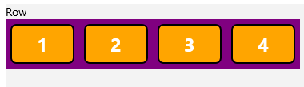
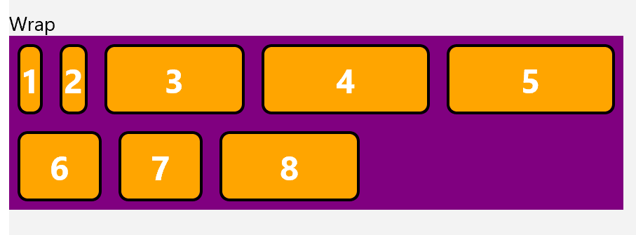
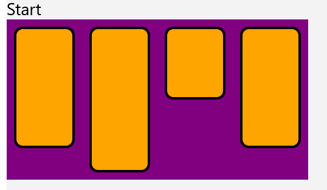
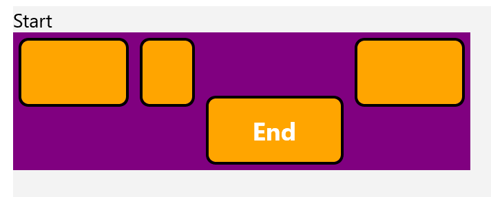

Flexbox Layout for WinUI 
===

# Background


Flexbox Layout is designed to provide an efficient way to layout, align, and distribute space among items within a container, specifically when the size of the device is either unknown or dynamic.

Flexbox is a widely used layout schematic in web development, it allows developers to quickly create complex layouts with a standardized system. By introducing Flexbox to WinUI we can increase the layout choices developers have and cater to those who desire to use this popular layout in their WinUI applications.

More on Flexbox available here: https://css-tricks.com/snippets/css/a-guide-to-flexbox/#aa-flexbox-properties


# Remarks


WinUI Offers several Layout options, such as StackLayout and Flowlayout. Usage of Flexbox Layout will behave similarly and interact by wrapping your desired elements in a Layout Control.

#### Flex Containers vs Flex Items

Flex Containers are elements that hold and specify the arangement of Flex Items. Containers have the following accepted properties:
| Property | 
|-|
| Direction |
Wrap|
JustifyContent|
AlignItems|
AlignContent|

Flex Items are elements that are children of a Flex Container. Items have the following accepted properties:
| Property | 
|-|
Order|
Grow|
Shrink|
Basis|
AlignSelf|
Unit|


#### Traditional CSS Behavior vs Flexbox in WinUI

Several behaviors may deviate from the exact behavior found in CSS Flexbox, to highlight one in XAML, items do not overflow their containers, instead they will be omitted from the layout.


# API Pages

_(Each of the following L2 sections correspond to a page that will be on docs.microsoft.com)_


## Flex Direction


The flex-direction property specifies the direction of the flexible items.
Note: If the element is not a flexible item, the flex-direction property has no effect.


```xml
<controls:LayoutPanel>
    <controls:LayoutPanel.Layout>
        <controls:FlexboxLayout Direction="Row"/>
    </controls:LayoutPanel.Layout>
            <Grid>
                <TextBlock>1</TextBlock>
            </Grid>
            <Grid>
                <TextBlock>2</TextBlock>
            </Grid>
            <Grid>
                <TextBlock>3</TextBlock>
            </Grid>
            <Grid>
                <TextBlock>4</TextBlock>
            </Grid>
</controls:LayoutPanel>
```


### Output of the above code (styling omitted)



##  Flex Direction Accepted Values

| Value | Description |
|-|-|
| Row (Default) | The flexible items are displayed horizontally, as a row |
| RowReverse | Same behavior as Row, but elemnts are shown in reverse |
| Column | The flexible items are displayed vertically, as a column |
| ColumnReverse | Same behavior as Column, but elemnts are shown in reverse |

# API Details

```c# (but really MIDL3)

runtimeclass FlexboxLayout;

    enum FlexboxDirection
        {
            Row = 0,
            RowReverse = 1,
            Column = 2,
            ColumnReverse = 3
        }
```

## Flex Wrap

The flex-wrap property specifies whether the flexible items should wrap or not.

Note: If the elements are not flexible items, the flex-wrap property has no effect.

```xml

<controls:LayoutPanel MaxWidth="500">
    <controls:LayoutPanel.Layout>
        <controls:FlexboxLayout Direction="Row" Wrap="Wrap"/>
    </controls:LayoutPanel.Layout>
            <Grid MinWidth="10">
                <TextBlock>1</TextBlock>
            </Grid>
            <Grid MinWidth="20">
                <TextBlock>2</TextBlock>
            </Grid>
            <Grid MinWidth="100">
                <TextBlock>3</TextBlock>
            </Grid>
            <Grid MinWidth="120">
                <TextBlock>4</TextBlock>
            </Grid>
            <Grid MinWidth="120">
                <TextBlock>5</TextBlock>
            </Grid>
            <Grid MinWidth="60">
                <TextBlock>6</TextBlock>
            </Grid>
            <Grid MinWidth="60">
                <TextBlock>7</TextBlock>
            </Grid>
            <Grid MinWidth="100">
                <TextBlock>8</TextBlock>
            </Grid>
        </controls:LayoutPanel>
```
### Output of the above code (styling omitted)



##  Flex Wrap Accepted Values

| Value | Description |
|-|-|
| NoWrap (Default) | Default value. Specifies that the flexible items will not wrap |
| Wrap | Specifies that the flexible items will wrap if necessary	|
| WrapReverse | Specifies that the flexible items will wrap, if necessary, in reverse orde |


# API Details

```c# (but really MIDL3)

runtimeclass FlexboxLayout;

    enum FlexboxWrap
        {
            NoWrap = 0,
            Wrap = 1,
            WrapReverse = 2,
        }
```


## Flex JustifyContent

The justify-content property aligns the flexible container's items when the items do not use all available space on the main-axis (horizontally).

```xml

<controls:LayoutPanel>
    <controls:LayoutPanel.Layout>
        <controls:FlexboxLayout JustifyContent="Start"/>
    </controls:LayoutPanel.Layout>
            <Grid MinWidth="120"/>
            <Grid MinWidth="60"/>
            <Grid MinWidth="120"/>
</controls:LayoutPanel>
```

### Output of the above code (styling omitted)


##  Flex JustifyContent Accepted Values

| Value | Description |
|-|-|
| Start (Default) | Items are positioned at the beginning of the container |
| End | Items are positioned at the end of the container|
| Center | Items are positioned in the center of the container |
| SpaceBetween | Items will have space between them |
| SpaceAround | Items are positioned at the end of the container|
| SpaceEvenly | Items will have space before, between, and after them	 |

# API Details


```c# (but really MIDL3)

runtimeclass FlexboxLayout;

    enum FlexboxJustifyContent
        {
            Start = 0,
            End = 1,
            Center = 2,
            SpaceBetween = 3,
            SpaceAround = 4,
            SpaceEvenly = 5
        }
```

## Flex AlignItems

The align-items property specifies the default alignment for items inside the flexible container.

```xml

<controls:LayoutPanel>
            <controls:LayoutPanel.Layout>
                <controls:FlexboxLayout Direction="Row" AlignItems="Start"/>
            </controls:LayoutPanel.Layout>
            <Grid MinHeight="100"/>
            <Grid MinHeight="120"/>
            <Grid MinHeight="60"/>
            <Grid MinHeight="100"/>
        </controls:LayoutPanel>
```

### Output of the above code (styling omitted)


##  Flex AlignItems Accepted Values

| Value | Description |
|-|-|
| Stretch (Default) |Items are stretched to fit the container |
| Center | Items are positioned at the center of the container	|
| Start | Items are positioned at the beginning of the container|
| End | Items are positioned at the end of the container|

# API Details

```c# (but really MIDL3)

runtimeclass FlexboxLayout;

    enum FlexboxAlignItems
        {
            Start = 0,
            End = 1,
            Center = 2,
            Stretch = 3
        }
```


## Flex AlignContent

The align-content property modifies the behavior of the flex-wrap property. It is similar to align-items, but instead of aligning flex items, it aligns flex lines.

Note: There must be multiple lines of items for this property to have any effect.

```xml
<controls:LayoutPanel MaxWidth="300" MinHeight="180">
    <controls:LayoutPanel.Layout>
        <controls:FlexboxLayout Wrap="Wrap" AlignContent="End"/>
    </controls:LayoutPanel.Layout>
            <Grid MinWidth="80"/>
            <Grid MinWidth="100"/>
            <Grid MinWidth="50"/>
            <Grid MinWidth="40"/>
            <Grid MinWidth="40"/>
            <Grid MinWidth="80"/>
            <Grid MinWidth="60"/>
            <Grid MinWidth="60"/>
            <Grid MinWidth="60"/>
</controls:LayoutPanel>
```

### Output of the above code (styling omitted)


##  Flex AlignContent Accepted Values

| Value | Description |
|-|-|
| Stretch (Default) | Lines stretch to take up the remaining space |
| Center | Lines are packed toward the center of the flex container	|
| Start | Lines are packed toward the start of the flex container	|
| End | Lines are packed toward the end of the flex container	|
| SpaceBetween | Lines are evenly distributed in the flex container	 |
| SpaceAround | Lines are evenly distributed in the flex container, with half-size spaces on either end	|
| SpaceEvenly | 	Lines are evenly distributed in the flex container, with equal space around them	|

# API Details


```c# (but really MIDL3)

runtimeclass FlexboxLayout;

    enum FlexboxAlignContent
        {
            Start = 0,
            End = 1,
            Center = 2,
            Stretch = 3,
            SpaceBetween = 4,
            SpaceAround = 5,
            SpaceEvenly = 6
        }
```


## Flex Order

The order property specifies the order of a flexible item relative to the rest of the flexible items inside the same container.

Note: If the element is not a flexible item, the order property has no effect.


```xml
        <controls:LayoutPanel>
            <controls:LayoutPanel.Layout>
                <controls:FlexboxLayout/>
            </controls:LayoutPanel.Layout>
            <Grid controls:FlexboxLayout.Order="5">
                <TextBlock>5</TextBlock>
            </Grid>
            <Grid controls:FlexboxLayout.Order="-1">
                <TextBlock>-1</TextBlock>
            </Grid>
            <Grid controls:FlexboxLayout.Order="2">
                <TextBlock>2</TextBlock>
            </Grid>
            <Grid controls:FlexboxLayout.Order="1">
                <TextBlock>1</TextBlock>
            </Grid>
        </controls:LayoutPanel>
```

### Output of the above code (styling omitted)


##  Flex Order Accepted Values


| Value | Description |
|-|-|
| Number (Default Value = 0) | Specifies the order for the flexible item |

# API Details


```c# (but really MIDL3)

unsealed runtimeclass FlexboxLayout : NonVirtualizingLayout
    
    {
        static Windows.UI.Xaml.DependencyProperty OrderProperty{ get; };
        static void SetOrder(Windows.UI.Xaml.UIElement element, Int32 value);
        static Int32 GetOrder(Windows.UI.Xaml.UIElement element);
    }
```


## Flex Grow

The flex-grow property specifies how much the item will grow relative to the rest of the flexible items inside the same container.

Note: If the element is not a flexible item, the flex-grow property has no effect.


```xml
 <controls:LayoutPanel MinWidth="500">
            <controls:LayoutPanel.Layout>
                <controls:FlexboxLayout/>
            </controls:LayoutPanel.Layout>
            <Grid controls:FlexboxLayout.Grow="0" controls:FlexboxLayout.Basis="100" >
                <TextBlock>0</TextBlock>
            </Grid>
            <Grid controls:FlexboxLayout.Grow="1" controls:FlexboxLayout.Basis="100">
                <TextBlock>1</TextBlock>
            </Grid>
            <Grid controls:FlexboxLayout.Grow="0" controls:FlexboxLayout.Basis="100">
                <TextBlock>0</TextBlock>
            </Grid>
        </controls:LayoutPanel>
```

### Output of the above code (styling omitted)


##  Flex Grow Accepted Values


| Value | Description |
|-|-|
| Number (Default Value = 0) | Specifies how much the item will grow relative to the rest of the flexible items. |

# API Details


```c# (but really MIDL3)

unsealed runtimeclass FlexboxLayout : NonVirtualizingLayout
    
    {
        static Windows.UI.Xaml.DependencyProperty GrowProperty{ get; };
        static void SetGrow(Windows.UI.Xaml.UIElement element, Double value);
        static Double GetGrow(Windows.UI.Xaml.UIElement element);
    }
```


## Flex Shrink

The flex-shrink property specifies how the item will shrink relative to the rest of the flexible items inside the same container.

Note: If the element is not a flexible item, the flex-shrink property has no effect.


```xml
<controls:LayoutPanel Width="500">
    <controls:LayoutPanel.Layout>
          <controls:FlexboxLayout/>
    </controls:LayoutPanel.Layout>
            <Grid controls:FlexboxLayout.Shrink="1" Width=" 250">
                <TextBlock>1</TextBlock>
            </Grid>
            <Grid controls:FlexboxLayout.Shrink="1" Width=" 250">
                <TextBlock>1</TextBlock>
            </Grid>
            <Grid controls:FlexboxLayout.Shrink="1" Width=" 250">
                <TextBlock>1</TextBlock>
            </Grid>
</controls:LayoutPanel>
```

### Output of the above code (styling omitted)

todo


##  Flex Shrink Accepted Values


| Value | Description |
|-|-|
| Number (Default Value = 1) | Specifies how much the item will shrink relative to the rest of the flexible items. |

# API Details


```c# (but really MIDL3)

unsealed runtimeclass FlexboxLayout : NonVirtualizingLayout
    
    {
         static Windows.UI.Xaml.DependencyProperty ShrinkProperty{ get; };
         static void SetShrink(Windows.UI.Xaml.UIElement element, Double value);
         static Double GetShrink(Windows.UI.Xaml.UIElement element);
    }
```


## Flex Basis

The flex-basis property specifies the initial length of a flexible item.

Note: If the element is not a flexible item, the flex-basis property has no effect.


```xml
        <controls:LayoutPanel MinWidth="500">
            <controls:LayoutPanel.Layout>
                <controls:FlexboxLayout/>
            </controls:LayoutPanel.Layout>
            <Grid controls:FlexboxLayout.Basis="50" >
                <TextBlock>50</TextBlock>
            </Grid>
            <Grid controls:FlexboxLayout.Basis="100">
                <TextBlock>100</TextBlock>
            </Grid>
            <Grid controls:FlexboxLayout.Basis="150">
                <TextBlock>150</TextBlock>
            </Grid>
        </controls:LayoutPanel>
```

### Output of the above code (styling omitted)


##  Flex Basis Accepted Values


| Value | Description |
|-|-|
| Number | A number, specifying the initial length of the flexible item |

# API Details


```c# (but really MIDL3)

unsealed runtimeclass FlexboxLayout : NonVirtualizingLayout
    
    {
         static Windows.UI.Xaml.DependencyProperty BasisProperty{ get; };
         static void SetBasis(Windows.UI.Xaml.UIElement element, Double value);
         static Double GetBasis(Windows.UI.Xaml.UIElement element);
    }
```


## Flex AlignSelf

The align-self property specifies the alignment for the selected item inside the flexible container.

Note: The align-self property overrides the flexible container's align-items property.

```xml
<controls:LayoutPanel VerticalAlignment="Stretch" MinHeight="100">
    <controls:LayoutPanel.Layout>
        <controls:FlexboxLayout Wrap="Wrap" AlignItems="Start"/>
    </controls:LayoutPanel.Layout>
        
            <Grid MinWidth="80"/>
            <Grid MinWidth="40"/>
            <Grid MinWidth="100" controls:FlexboxLayout.AlignSelf="End">
                <TextBlock>End</TextBlock>
            </Grid>
            <Grid MinWidth="80"/>
        </controls:LayoutPanel>
```

### Output of the above code (styling omitted)


##  Flex AlignSelf Accepted Values

| Value | Description |
|-|-|
| Auto (Default) |The element inherits its parent container's align-items property, or "stretch" if it has no parent container	|
| Start | 	The element is positioned at the beginning of the container|
| End | The element is positioned at the end of the container	|
| Center | The element is positioned at the center of the container	|
| Stretch |The element is positioned to fit the container	|

# API Details

```c# (but really MIDL3)

runtimeclass FlexboxLayout;

    enum FlexboxAlignSelf
        {
            Auto = 0,
            Start = 1,
            End = 2,
            Center = 3,
            Stretch = 4,
        }
```


## Flexbox Unit

The flex-unit property will define the unit of measurement to be used by the flex-basis property.


```xml
        <controls:LayoutPanel MinWidth="500">
            <controls:LayoutPanel.Layout>
                <controls:FlexboxLayout/>
            </controls:LayoutPanel.Layout>
            <Grid controls:FlexboxLayout.Basis="50" Unit="pixels">
                <TextBlock>50</TextBlock>
            </Grid>
            <Grid controls:FlexboxLayout.Basis="100" Unit="pixels">
                <TextBlock>100</TextBlock>
            </Grid>
            <Grid controls:FlexboxLayout.Basis="150" Unit="pixels">
                <TextBlock>150</TextBlock>
            </Grid>
        </controls:LayoutPanel>
```

### Output of the above code (styling omitted)


##  Flex AlignSelf Accepted Values

| Value | Description |
|-|-|
| pixels (Default) |The unit of measurment input into the flex-basis property will be calculated in pixels |
| percent | The element's size will be calculated as a relative percentage of its container|


# API Details

```c# (but really MIDL3)

runtimeclass FlexboxLayout;

    enum FlexboxUnit
        {
            pixels = 0,
            percent = 1,

        }
```

# Appendix

## Open Issues


